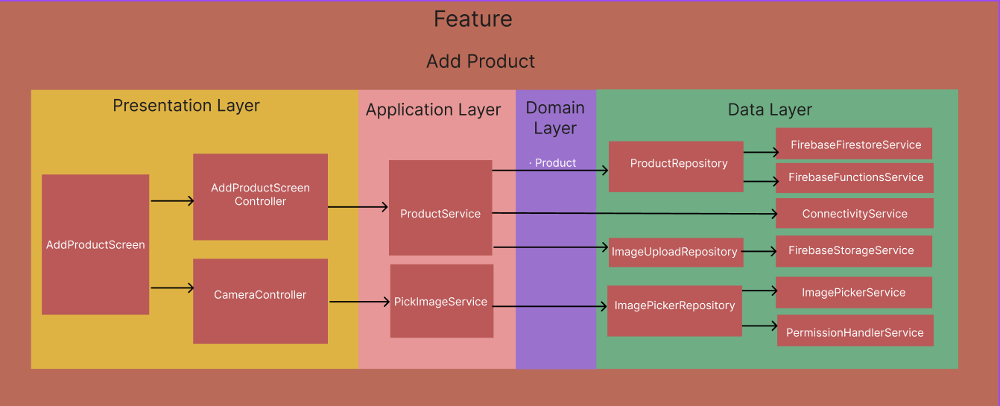

# flutter_folio

Welcome to FlutterFolio, a purpose-built showcase of effective Flutter coding practices, robust application architecture, and clean code principles. This project was created to provide a glimpse into how I structure my code, how I manage state and app architecture, and how I maintain clear boundaries between different logic components.

The primary goal of FlutterFolio is not to deliver a stunning user interface; while UI is undeniably important, this project emphasizes the architectural aspects of application development. This repository demonstrates how to create an application that is robust, testable, maintainable, and scalable - key characteristics of any successful, large-scale software project.

## Key Features

• Code Structure: FlutterFolio demonstrates a logical, clean folder structure, designed for scalability. As projects grow, a well-organized structure is crucial for manageability.

• State Management: A clear and efficient state management solution is implemented, ensuring that data flow in the app is predictable and easy to understand.

• App Architecture: The architecture of the app is carefully designed to separate concerns, making the code modular and easy to navigate. It provides clear boundaries between the different parts of the app, facilitating testing and maintenance.

• Error Handling: FlutterFolio demonstrates how to properly handle errors when dealing with external APIs. Robust error handling is essential for providing a smooth user experience and preventing the app from crashing unexpectedly.

• Testability: The code in this project is written to be testable. This allows for regular and systematic checks for potential errors, ensuring the app runs as expected.

• Scalability and Maintainability: By keeping a clear structure, separating concerns, managing states efficiently, and handling errors properly, the app becomes maintainable and ready to scale.

## Application Architecture

Welcome to the realm of Feature-Centric Architecture (FCA). Haven't heard of it yet? That's completely okay! The name is fresh off the press, coined by yours truly. The journey through this FlutterFolio will take you through the intimate workings of this innovative, yet intuitive architectural design.

FCA is not a reincarnation of MVC, MVVM, or Clean architectures that you may have encountered before. It's a distinctive path, an architectural pattern that has grown from my experiences and quest for a design that combines high modularity, clean code, and an organized structure, facilitating a seamless development experience.

In this odyssey of learning, you'll see how FCA contributes to a more maintainable, scalable, and testable application. It keeps each component focused, and the Single Responsibility Principle is not a guideline here, but a way of life. It deviates from traditional architectures to bring you a structure that makes the app easier to navigate, simpler to enhance, and a joy to test.

So, buckle up and enjoy the exploration of this new architectural landscape - the Feature-Centric Architecture. It's more than just a design pattern; it's a new perspective on structuring your Flutter applications.

## Feature-First Folder Structure

In FlutterFolio, the folder structure is organized by feature. Each feature has its own directory, and within this directory, there are subdirectories for distinct roles in the architecture: application, data, domain, and presentation.

/features
     /add_product
            /application  
                 product_service.dart
            /data  
                 product_repository.dart
            /domain 
                 product.dart
            /presentation   
                 add_product_screen_controller.dart
                 add_product_screen.dart 
                 
This structure encourages feature encapsulation and makes it easier to locate the different parts of a feature. 

## Explaining Each Folder
• application: Houses feature's service classes, which encapsulate business logic.
• data: Contains repository classes responsible for data access and manipulation.
• domain: Holds data models defining the structure of objects in use.
• presentation: Contains UI classes, including the actual UI code and controller classes that manage UI state and connect user actions to application logic.

This approach helps to keep our codebase clean and maintainable, with each part of the code having a single, clear responsibility.

## Architecture in Practice

Here's a simple diagram representing the interaction between different parts of a feature:

## Why This Approach?

The primary reason for this approach is to maintain clear boundaries between different components of a feature, ensuring robustness, scalability, and testability. Traditional architectures like MVC, MVVM, or Clean can sometimes lead to 'god classes' with too much responsibility. By strictly separating concerns, we avoid this pitfall, leading to a more maintainable and scalable application.

## Conclusion

I invite you to explore FlutterFolio to understand this approach in practice. If this is the kind of application architecture that aligns with your vision, I'd be thrilled to work together on your project. If not, I understand, and I encourage you to find a developer whose approach resonates with you. I believe in delivering not only a functional application but a well-architected, maintainable, and scalable solution.

For any questions or proposals, feel free to contact me.

Happy exploring!
